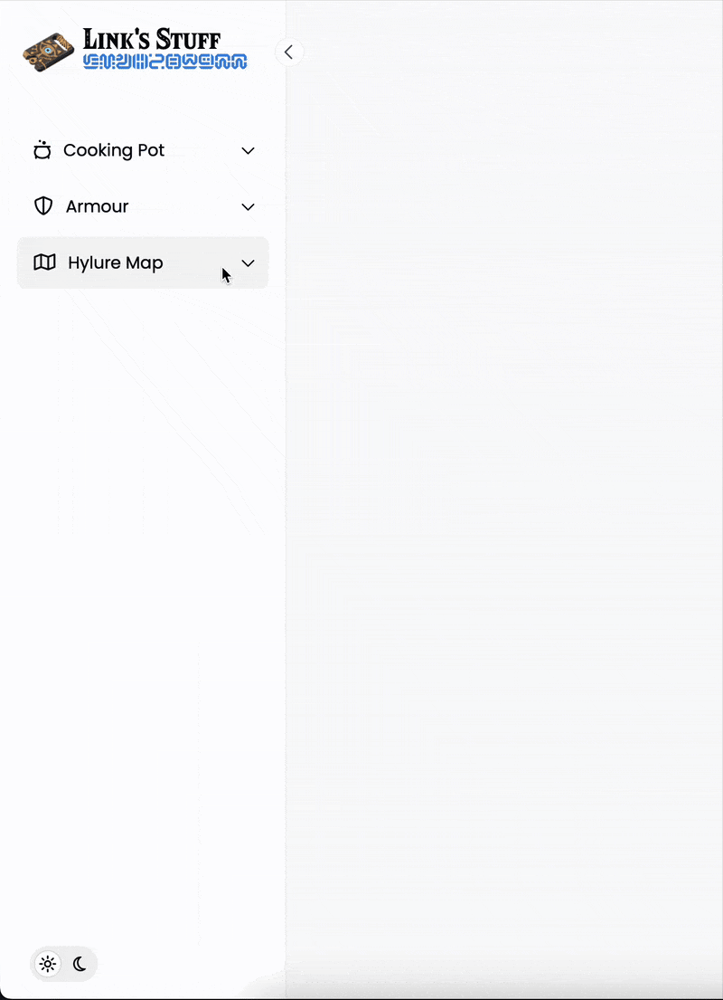

# Link's (Zelda) Stuff - Responsive Sidebar Dashboard

## 🛡️ Project Overview

A responsive sidebar navigation with dropdown menus and light/dark theme toggle, designed as Link's personal Hyrule dashboard to organise his stuff. Built with pure HTML, SCSS, and Vanilla JavaScript.



## ✨ Features

- **Zelda Fonts** Hylia and Sheikan
- **Fully responsive** (mobile, tablet, desktop)
- **Collapsible sidebar** with smooth animations
- **Interactive dropdown menus** (Cooking Pot, Armor, Map)
- **Dark/Light theme toggle** (with localStorage persistence)
- **Font Awesome icons** for authentic Zelda feel
- **BEM methodology** for clean CSS architecture

## 💻 Tech Stack


## 📂 Project Structure

```
hyrule-sidebar/
├── dist/
│   └── style.css
│   └── style.min.css
├── src/
│   ├── scss/
│   └── script.js
├── vendors/
│   └── fontawesome/
├── img/
│   └── compendium-logo.png
├── favicon/
├── index.html
└── README.md
```

## 🚀 Installation

1. Clone the repository:
   ```bash
   git clone https://github.com/your-username/hyrule-sidebar.git
   ```
2. Open in browser:
   ```bash
   cd hyrule-sidebar && open index.html
   ```

## 🎮 How to Use

- Click the ☰ menu button to toggle sidebar on mobile
- Click the chevron (‹) to collapse/expand sidebar
- Click category names to expand dropdown menus
- Toggle between ☀️ light and 🌙 dark themes

## 🧙‍♂️ Link's Stuff

| Category    | Items Included                        |
| ----------- | ------------------------------------- |
| Cooking Pot | Soups, Rice, Elixirs, Desserts        |
| Armor       | Head, Chest, Leg pieces               |
| Hyrule Map  | All 15 towers from Breath of the Wild |

## 📜 License

This project is licensed under the [MIT License](LICENSE.md) - free for personal and commercial use. Just don't be a copycat ;)
